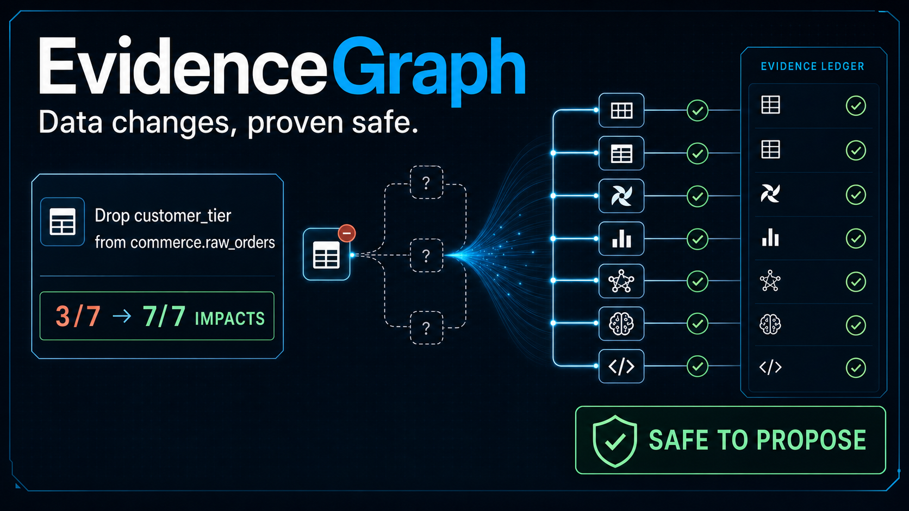
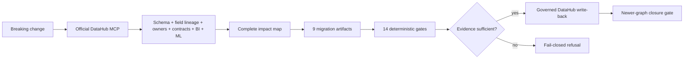

# EvidenceGraph

> A DataHub-native data-change assurance compiler that turns a breaking change into a
> completeness-verdict impact map, validated migration code, and an evidence-backed go/no-go decision.

[**Live public replay**](https://github.com/agentic-build-lab/evidencegraph-datahub) ·
[**Frozen evidence package**](examples/README.md) ·
[Architecture](docs/architecture.md) ·
[Demo guide](docs/DEMO.md) ·
[Security](docs/SECURITY.md)



Removing `customer_tier` looks manageable to a repository-only scanner: it finds 3 of 7
affected assets. It cannot see the executive dashboard or the production ML feature → model →
deployment chain. DataHub reveals all 7 consumers. EvidenceGraph makes that context executable:
it compiles a coordinated migration pack, runs a 14-gate validation suite, and refuses unsafe
actions. In a controlled, explicitly approved local DataHub run, it writes three scoped metadata
results to DataHub and verifies each by readback.

| Measured on the frozen synthetic truth set | Repository only | DataHub context |
| ------------------------------------------ | --------------: | --------------: |
| Affected assets found                      |           3 / 7 |       **7 / 7** |
| Overall recall                             |           42.9% |      **100.0%** |
| BI recall                                  |            0.0% |      **100.0%** |
| ML recall                                  |            0.0% |      **100.0%** |
| False-safe decision                        |             Yes |          **No** |

**Measured improvement: +57.1 percentage points.** See the independent
[truth manifest](examples/flagship/truth-manifest.json) and exact
[ablation result](examples/ablation/comparison.json).

## What the agent does



DataHub is not a lookup layer here. Its metadata directly determines:

- which dbt models, Airflow jobs, dashboards, ML features, models, deployments, and teams are
  in scope;
- whether a column-level patch is safe to generate at all;
- the remediation order and owner routing;
- every impact claim's provenance and confidence;
- whether the agent may propose or execute metadata changes.

Remove precise column lineage, an owner, a required validator, or a fresh post-change
observation and the outcome changes from a migration proposal to a machine-readable refusal.

The paired public replays make that causal effect inspectable. With the recorded complete
graph, EvidenceGraph grounds 7 of 7 declared impacts and allows write-back proposals only after
all 14 gates pass. Remove one lineage page and confidence is capped at 0.65, the same nine
drafts are quarantined, and write-back proposals fall to zero. The 1.00/0.65 values are
deterministic policy scores in the frozen flagship scenario, not calibrated production probabilities.

Every impact claim links to DataHub URNs and recorded observations. Every generated file links
to the claim IDs and target objects it used. Every validation result links to an artifact hash
and a structured receipt.

Agenticity here means a bounded observe → derive → compile → validate → decide → act →
read-back loop whose next action is determined by evidence state, not a scripted chat response.
In the intended platform-engineering workflow, an engineer attaches a change proposal to a
pull request, reviews the generated owner-routed migration pack, approves scoped metadata
write-back, and uses the closure receipt as the merge or rollout gate.

## Flagship result

The miniature platform contains a Postgres producer, two dbt transformations, an Airflow job,
a Looker dashboard, an ML feature, a production model and deployment, owners, documentation,
tags, and native DataHub dataset contracts.

For proposal `EG-042`, EvidenceGraph produces **9 evidence-bound artifacts**:

- a DuckDB-compatible SQL compatibility view and parity query;
- a dbt model, schema contract, and seven schema/data tests;
- a real unified diff against the committed miniature platform;
- an Airflow DAG with a Python evidence-ledger gate before publication;
- a versioned ML feature migration contract;
- a risk-ranked migration plan and claim-binding manifest.

The frozen run passed **14/14 deterministic gates**: one artifact-integrity and
evidence-binding check, eight structured-file parser checks, and five native or integration
checks:

- DuckDB preserved 4/4 synthetic rows;
- dbt Core 1.12.0 completed `dbt build` with 7/7 tests;
- the official `apache/airflow:3.3.0-python3.12` image imported the DAG and executed its gate;
- ML mapping parity passed at 0.0% mismatch;
- `git apply --check` proved the generated patch applies cleanly;
- every artifact hash and claim binding was verified.

Inspect the [live sanitized ledger](examples/flagship/evidence-ledger.live.sanitized.json),
[validation receipts](examples/flagship/validation-receipts.json), and
[migration pack](examples/flagship/migration/).

## Quick deterministic replay

Python 3.11 or 3.12 is supported. Docker is required for the official Airflow
container path. Native Airflow execution is unsupported on Windows; use the
pinned Docker image or run the validation suite in WSL2/Linux. EvidenceGraph
fails this gate closed when neither path is available.

```bash
uv sync --all-extras --locked --python 3.12
uv run --no-sync evidencegraph demo --output outputs/demo
uv run --no-sync evidencegraph ablation
```

Expected on Linux, WSL2, or Windows with the pinned Airflow image available:
7 impacts, 9 artifacts, 14/14 validators passed, and a dry-run write-back
proposal. Windows without the pinned container intentionally reports 13/14 and
blocks the proposal at `VAL-AIRFLOW-DAG`. No DataHub account, token, LLM key,
or network access is required after dependencies and the selected native
validation environment are installed.

## Live DataHub + MCP path

The verified local integration runs DataHub OSS v1.6.0 and pins the official
`mcp-server-datahub@0.6.0` stdio server. MCP performs search, entity/schema reads, paginated
dataset and column lineage, and governed mutations. The Python SDK is explicitly labeled and
used only for aspect gaps in the current MCP surface: document contents, native contract
details, ML properties, and the deployment relationship.

```bash
uv sync --all-extras --locked --python 3.12
uv run --no-sync python scripts/bootstrap_datahub.py --gms-url http://localhost:8080
uv run --no-sync python scripts/verify_mcp.py --gms-url http://localhost:8080
uv run --no-sync evidencegraph analyze-live \
  --change fixtures/changes/drop_customer_tier.json \
  --gms-url http://localhost:8080 \
  --output outputs/live
```

Remote bootstrap targets require an additional `--allow-remote-bootstrap` gate; remote HTTP
and URL-embedded credentials are rejected.

## Safety by construction

EvidenceGraph preserves `absent`, `not_queried`, `read_failed`, `incomplete`, `unsupported`,
`observed`, `derived`, and `contradicted` as distinct states. It refuses safe-to-merge and
write-back when, among other conditions:

- lineage pagination or the traversal frontier is incomplete;
- the source field or exact field mapping is not observed;
- a high-risk affected asset has no owner;
- metadata-derived SQL does not match the approved B/S/G contract;
- any required validator fails, skips, or is unavailable;
- a mutation target is outside the configured demo scope or cannot be read back;
- closure relies on a graph observation older than the applied patch.

The public demo exposes no mutation endpoint. Live metadata writes require `--apply`,
`EVIDENCEGRAPH_ENABLE_WRITES=true`, discovered MCP mutation tools, an explicit proposal approval,
a scope tag, an approved target-set digest, and per-target readback.

The final local run recorded **3/3 `applied_verified`** receipts. A new MCP client then retried
the identical proposal set and recorded **3/3 `skipped_idempotent_verified`** no-ops, including
the same DataHub document URN. See the [apply receipts](examples/flagship/writeback-receipts.json)
and [retry receipts](examples/flagship/writeback-retry-receipts.json).

## Fresh-graph closure

Closure is not inferred from the migration plan. EvidenceGraph requires a different, complete
snapshot whose oldest observation is newer than the applied revision, a producer schema and
contract matching the approved after-state, all required validators passed, and zero remaining
consumers of the old source field. The committed deterministic replay includes the
[before graph](examples/closure/before-graph.json),
[after graph](examples/closure/after-graph.json), and
[closure receipt](examples/closure/closure-receipt.json). Reusing the stale graph is covered by
an automated refusal test.

## Repository map

| Path                               | Purpose                                                                                     |
| ---------------------------------- | ------------------------------------------------------------------------------------------- |
| `src/evidencegraph/`               | Typed collector, impact engine, planner, generator, validators, policy, write-back, closure |
| `demo_platform/`                   | Real miniature dbt, Airflow, Looker, and ML source files                                    |
| `fixtures/`                        | Synthetic platform, proposal, independent truth set, before/after closure graphs            |
| `examples/`                        | Frozen judge-readable live evidence, migration pack, receipts, refusals, checksums          |
| `skills/datahub-change-assurance/` | Reusable DataHub change-assurance Skill                                                     |
| `site/`                            | Source of the no-login public evidence replay                                               |
| `docs/`                            | Architecture, security, reproducibility, limitations, claims, and event research            |
| `submission/`                      | Devpost copy, video script, gallery plan, feedback, and release manifest                    |

## DataHub open-source contributions

The EvidenceGraph integration and security review produced four focused pull requests to the
official DataHub Skills repository: an MCP mutation-tool documentation correction, a dead-command
routing fix, credential-handling hardening, and a deterministic Bash test-runner fix. See the
[contribution ledger](docs/OPEN_SOURCE_CONTRIBUTIONS.md) for upstream links, reproductions,
validation evidence, and current review status. EvidenceGraph does not depend on their acceptance.

## Tests and provenance

```bash
uv run --no-sync ruff check .
uv run --no-sync mypy src scripts
uv run --no-sync pytest -q
```

The suite covers malformed proposals, missing column lineage, malicious metadata, cycles and
truth-set regressions, validator fail-close behavior, scoped mutations, partial writes, document
collisions, exact readback, idempotent retry, and stale closure. See
[HACKATHON_PROVENANCE.md](HACKATHON_PROVENANCE.md) for the new-project disclosure and
[docs/LIMITATIONS.md](docs/LIMITATIONS.md) for the declared boundaries.
The pinned history/archive secret scan and publication-asset allowlist are in
[docs/RELEASE_GATES.md](docs/RELEASE_GATES.md).

## License

Apache License 2.0. See [LICENSE](LICENSE) and [THIRD_PARTY_NOTICES.md](THIRD_PARTY_NOTICES.md).
