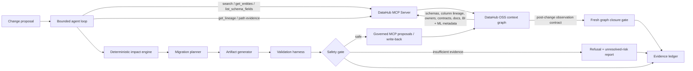
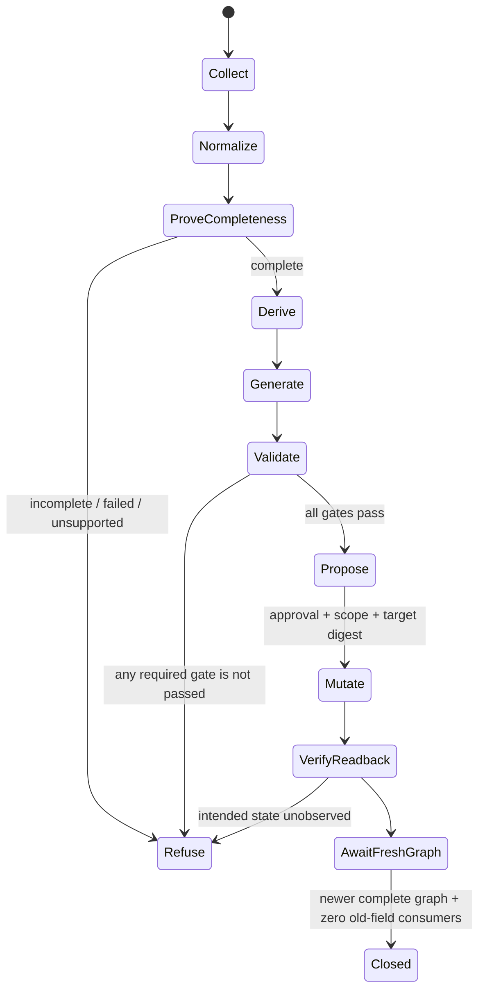

# EvidenceGraph Architecture

## Product boundary

EvidenceGraph accepts a proposed data change and returns four coupled outputs:

1. a downstream impact graph with an explicit completeness verdict;
2. a risk-ranked migration and remediation plan;
3. pull-request-ready migration artifacts with deterministic validation results;
4. an evidence ledger that distinguishes observations, derived claims,
   unresolved risks, and proposed DataHub mutations.

## Read, reason, act, verify, remember

## Trust boundaries

- **DataHub observations:** responses from named MCP tools, retained with source
  URNs, timestamps, normalized payload hashes, and confidence.
- **Deterministic derivations:** reachability, path enumeration, severity, and
  validation are computed by versioned code and are reproducible.
- **Model suggestions:** an optional LLM may improve wording or propose artifact
  variants, but cannot create facts or bypass policy and validation gates.
- **External effects:** live writes are disabled by default and require an
  operator flag, an independent process-level enablement, observed MCP mutation
  capability, exact proposal approval, a scoped target digest, and readback.
  EvidenceGraph never edits production data directly.

## DataHub interface strategy

The official DataHub MCP Server is the primary agent interface because its tool
catalog is inspectable and its read/write annotations support a visible safety
boundary. The DataHub Python SDK and GraphQL API are limited to deterministic
demo metadata bootstrap and capabilities that MCP does not expose. The repository-local
`datahub-change-assurance` Skill provides a reusable IDE-native workflow for human-reviewed
migration work.

| Interface | Pinned release | EvidenceGraph responsibility |
| --- | --- | --- |
| DataHub OSS | v1.6.0 | Stores the heterogeneous operational context graph and durable write-back. |
| Official DataHub MCP Server | `mcp-server-datahub@0.6.0` | Primary search, entity/schema, paginated lineage, document search, and allowlisted mutation boundary. |
| DataHub Python SDK | `acryl-datahub==1.6.0.6` | Synthetic bootstrap and narrow aspect enrichment where MCP does not expose document contents, contract details, or the ML deployment relationship. |
| DataHub Skill | `skills/datahub-change-assurance` | Reusable agent workflow and public-claim guardrails. |

## Completeness contract

EvidenceGraph does not describe a blast radius as complete merely because the
first page of lineage results was returned. A collector must:

- follow pagination until exhausted;
- traverse downstream lineage to the configured maximum depth;
- record truncation, permission, and unsupported-entity signals;
- retain every distinct path, including dashboard and ML paths;
- downgrade confidence and block writes when completeness cannot be established.

## Bounded state machine

Evidence states remain distinct through serialization and policy: `observed`, `absent`,
`not_queried`, `read_failed`, `incomplete`, `unsupported`, `derived`, `unresolved`, and
`contradicted`. An observed absence may be usable after an exhaustive query; a read failure or
unqueried interface is never rendered as “no impact.”

## Governed write-back and closure

Every mutation proposal binds the allowlisted tool, expected URN set, maximum target count,
scope tag, and SHA-256 target digest. The executor validates the pre-state, requires explicit
approval, verifies every target, and protects documents with an independent content ownership
marker plus exact-title matching. A stateless retry skips tags, descriptions, and documents only
after their intended state is observed.

Closure is a separate decision. It requires an applied patch digest, a different complete
snapshot whose oldest observation postdates the application time, the approved producer
after-contract, all required native validator receipts, and zero downstream impacts for the old
field. A stale or identical graph is refused.
